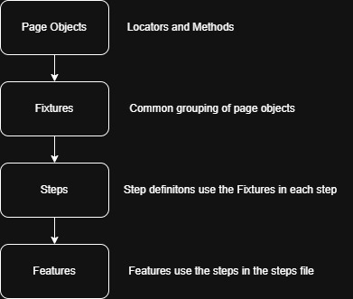

# playwright_assessment

## Tools

**Playwright-BDD** - https://vitalets.github.io/playwright-bdd/#/  
**Playwright Test** - https://github.com/microsoft/playwright  

## Instructions installation and running the tests

### 1. Clone the repository to a folder on your local machine

    git clone https://github.com/JohnRudden/playwright_assessment.git

### 2. Install dependencies

    npm install

### 3. Install Playwright browsers - Chromium, Firefox and Webkit

    npx playwright install

### 4. Run the complete set of tests (note : workers have been set to 4 currently - you can change this in package.json under the 'test' script command)

    npm run test

### 5. View the test report

    If you have used the 'npm run test' command in the previous instruction, then the cucumber report will open automatically once the test has finished.
    Otherwise you can enter the following command from the cli (post test run) :

    npx http-server ./cucumber-report -c-1 -a localhost -o index.html

## Initial assumptions -

1. Will be using Imperative style BDD
2. Will use localling running browsers - chromium, firefox and webkit
3. Config will be required for both desktop ~~and mobile simulated devices (time permitting)~~ (only desktop achieved within time frame)
4. Will use page objects as part of fixtures
5. Test steps will be as generic as possible if appropiate to aid maintainaility and reuse
6. It would be possible to use 'decorators' for the 'Given, When, Then' steps in the page object but to simplify and aid readability will use separates steps file instead
7. Will try to leave more of the assertions within the 'Then' steps but some basic checks may be done in 'Given' setup state steps
8. Will screen shot on failure and retain video
9. Will strive for no flakey tests. Will use the -x and --repeat-each options when running and testing the pack
10. Will follow best practices such as

    - testing user visible behaviour (using playwrights getBy locators where possible)
    - isolated tests
    - Using web first assertions which will autowait
    - Follow DRY principles

11. There will be cases where I will have two simlar steps - such as the search box in the header or main page but will try and refine this down to options in one step (time permitting)
12. An assumtion has been made, for the naviation check success assertion that most of the pages will have a H1 heading for the partiular topic (except for Home page)
13. Assuming tools like Prettier and linting are out of scope
14. The steps are currently contains in one file (Given, When, Then) - would consider splitting these into separate files for clarity but will leave for now
15. Page Object Methods are part of Class but not instance of the class via constructor (may change this)

# Feature: Basic Search notes

1.  Focused on the search box in the header, but a reusable search function could be implemented. An option to specify either a 'header' or 'main' page search could be included,
    allowing both search boxes to be checked with minimal code effort.
2.  Mocking of results using playwright api mocking feature would be potentially useful

# Feature: Navigate to a specific link notes

As the site can use both keyboard or mouse I want to include that as an option for navigating using a single function but passing in an argument of inputDevice in a step.
The aim is to use the "Tab" and "Enter" keys to navigate down to the menu item (evaluating when each item is in focus) and the selecting the correct option
Of course a simpler method would have been to go directly to the Timeline content block URL but that would not test the UI

> [!NOTE]
> Tabs not working correctly in webkit for the menu items - need to investigate

# Feature: Browsing by collection

Reused the site navigation pageobject functions using keyboard etc. Add some new ones in the exploreTheCollections page object. The odea being will tab to (or click on) a letter only if it is enabled otherwise will fail the test.

## Diagram of stucture of tests

